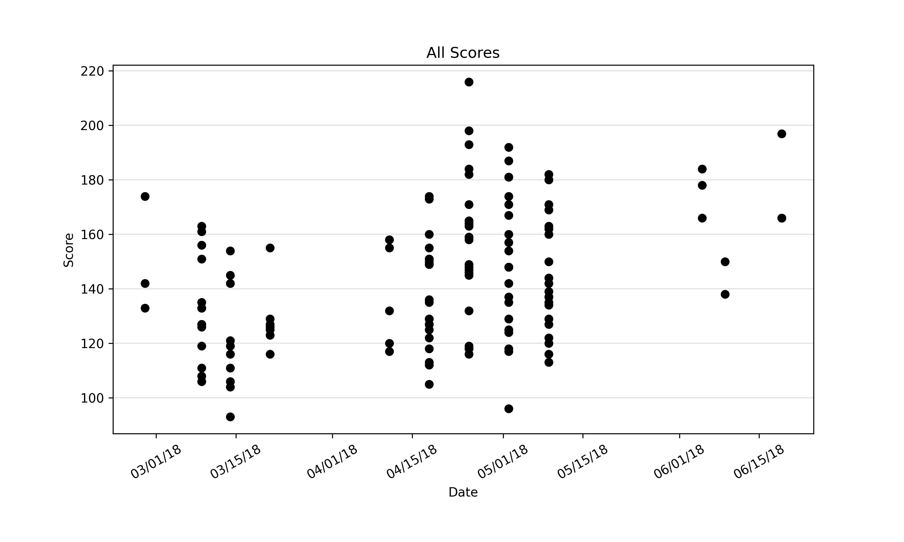
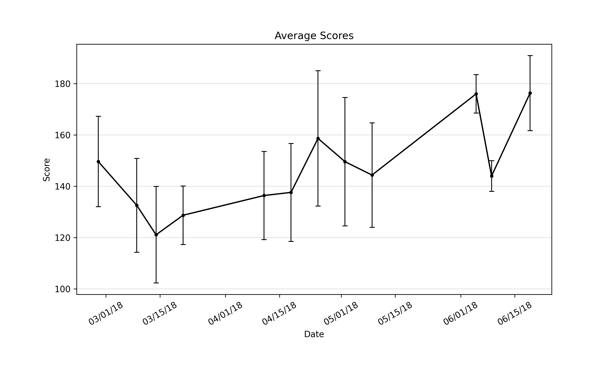
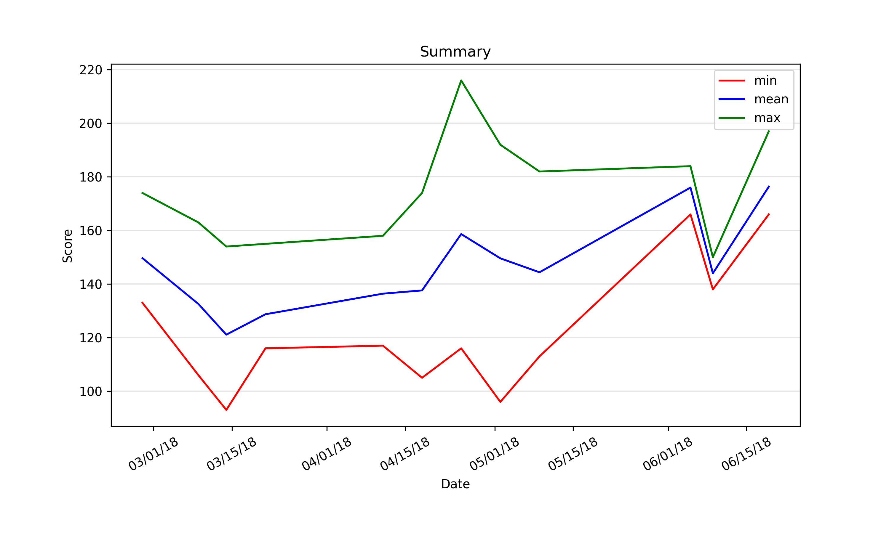

# Bowling Graph Generator

Generates plots of bowling data for data visualization.

## Usage

```txt
Usage: plot.py [OPTIONS] JSON_FILE

  Given a JSON file containing bowling data, generate plots analyzing the
  data. The JSON file can be generated from an org file.

Options:
  -d, --output-dir PATH  Path to output directory.
  -o, --org-file PATH    Path to org file with bowling data. If this option is
                         provided, a JSON file with the name `JSON_FILE' will
                         be generated and used. If this option is not
                         provided, data will be read from `JSON_FILE'.
  --help                 Show this message and exit.
```

Two file formats containing the data are accepted: `json` and `org`.

### `json`

To generate the plots with `json` data, run

```bash
python plot.py foo.json
```

where `foo.json` contains data in the following format.

```json
[
  {
    "date": "Jul 7, 2017",
    "scores": [
      114,
      136,
      169
    ]
  },
  {
    "date": "Jul 8, 2017",
    "scores": [
      86,
      116,
      141
    ]
  }
]
```

The data must be in chronological order.

### `org`

`org` data can also be used to generate plots. This is done by converting the
`org` data into the correct `json` format then using the `json` data to
generate the plots. To generate the plots with `org` data, run

```bash
python plot.py foo.json --org-file foo.org
```

where `foo.json` is the name of the `json` file the data gets output to and
`foo.org` contains data in the following format.

```org
* Jul 7, 2017
- foo
- bowling (114, 136, 169)
- bar

* Jul 8, 2017
- foobar
- bowling (86, 116, 141)
```

Lines that are not headlines and do not contain the word `bowling` will be
ignored. Scores need to be placed in parentheses and delimited by commas.

## Output

Multiple plots are generated. The first plot shows individual scores, the
second plot shows the mean and standard deviation for each day, the third plot
shows the minimum, mean, and maximum scores for each day, and the fourth plot
shows the mean and range for each day as well as a moving average and
cumulative average.

Sample data is provided in the `example` directory.

```bash
python plot.py sample-data.json --org-file example/sample-data.org
```





