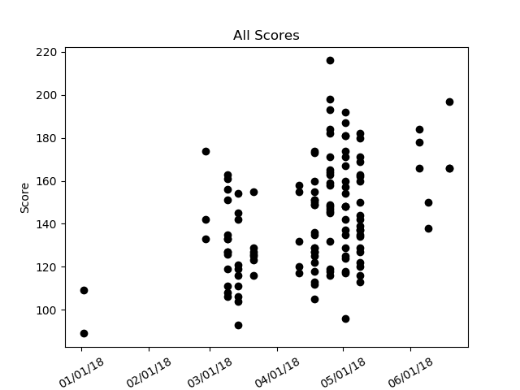
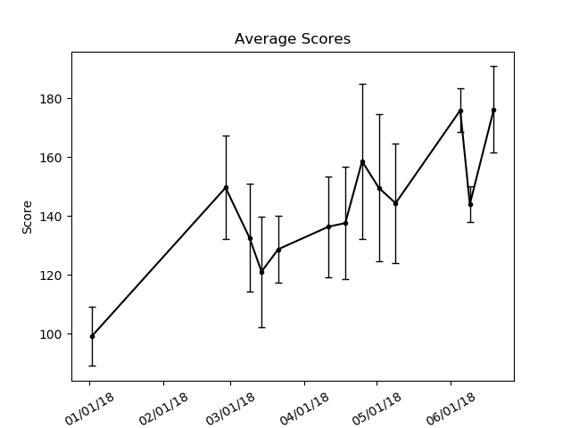
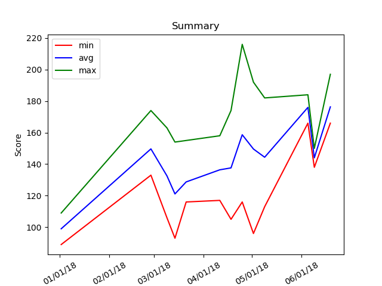

# Bowling Graph Generator

Generates plots of bowling data for data visualization.

## Usage

Two file formats containing the data are accepted: `json` and `org`.

### `json`

To generate the plots with `json` data, run

```bash
python plot.py foo.json
```

where `foo.json` contains data in the following format.

```json
[
  {
    "date": "Jul 7, 2017",
    "scores": [
      114,
      136,
      169
    ]
  },
  {
    "date": "Jul 8, 2017",
    "scores": [
      86,
      116,
      141
    ]
  }
]
```

The data must be in chronological order.

### `org`

`org` data can also be used to generate plots. This is done by converting the
`org` data into the correct `json` format then using the `json` data to
generate the plots. To generate the plots with `org` data, run

```bash
python plot.py foo.json --org-file foo.org
```

where `foo.json` is the name of the `json` file the data gets output to and
`foo.org` contains data in the following format.

```
* Jul 7, 2017
  - foo
  - bowling (114, 136, 169)
  - bar

* Jul 8, 2017
  - foobar
  - bowling (86, 116, 141)
```

Lines that are not headlines and do not contain the word `bowling` will be
ignored. Scores need to be placed in parentheses and delimited by commas.

## Output

Three plots are generated. The first plot shows individual game scores, the
second plot shows for each day the average and standard deviation, and the
third plot shows for each day the minimum, average, and maximum scores.

Sample data is provided in the `example` directory.

```bash
python plot.py sample-data.json --org-file sample-data.org
```




